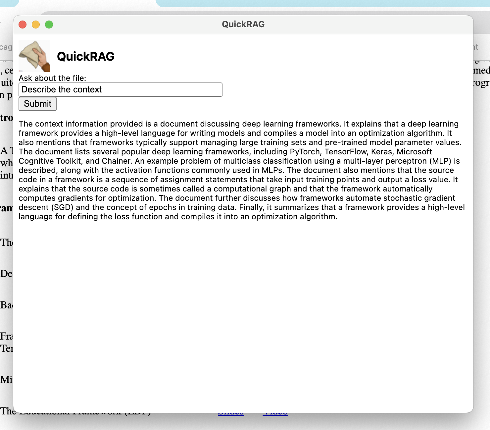
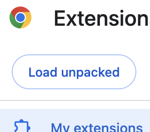

QuickRAG is a simple extension for Google Chrome that enables you to ask questions to contents of highlighted links, whether the links are links to pdfs or other documents. 



## Installation/Setup

To get set up, git clone this repository and in your Chrome extension menu, select "load unpacked", and load in QuickRAG/src. The "load unpacked" button below is visible in the "My extensions" window of your Chrome extensions page.



Since the RAG model uses OpenAI's GPT 3.5-turbo (specifically from utils.py), please add a .env file to QuickRAG/src and write in your OpenAI API and Huggingface API keys as:
OPENAI_API_KEY = "..."
HUGGINGFACE_API_KEY = "..."

Then, from directory QuickRAG/src in terminal, enter:
```
$ python3 server.py
```

Now, when highlighting links with QuickRAG enabled in your Google Chrome browser, you should get a QuickRAG menu option, which when clicked will bring you to the query engine page. 

